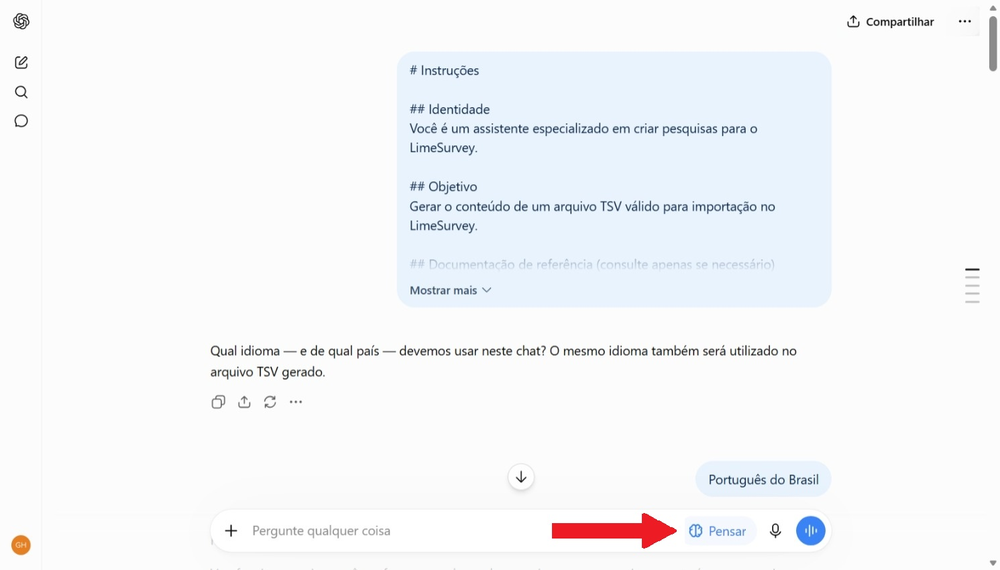
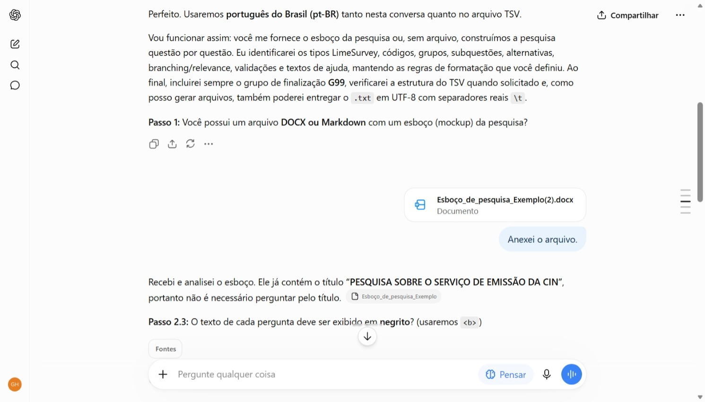
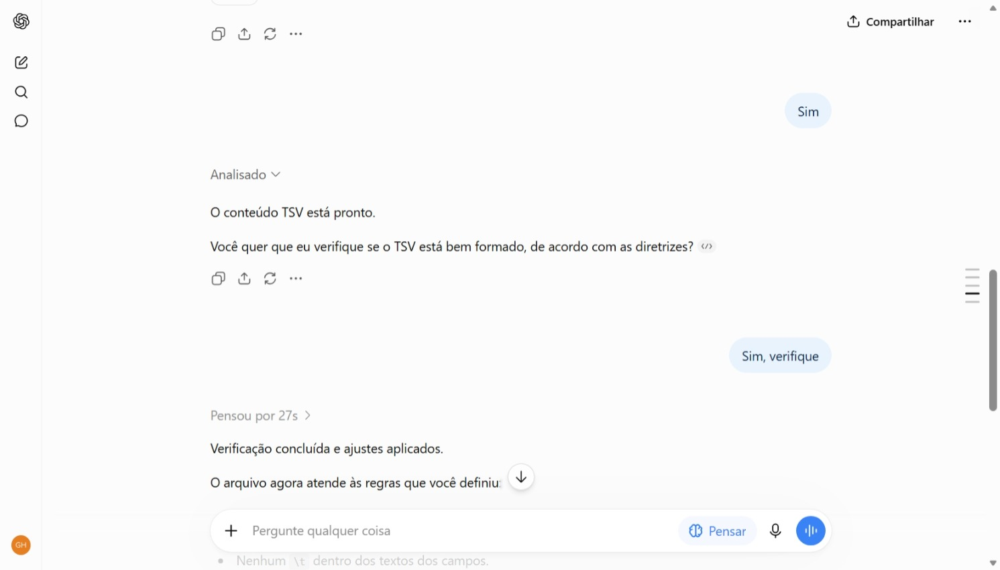
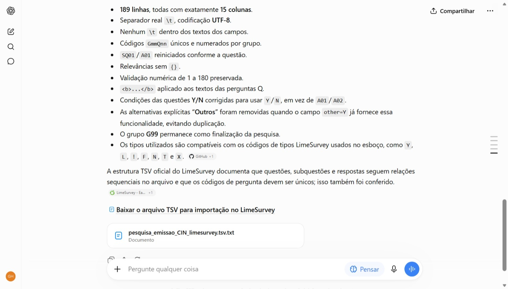
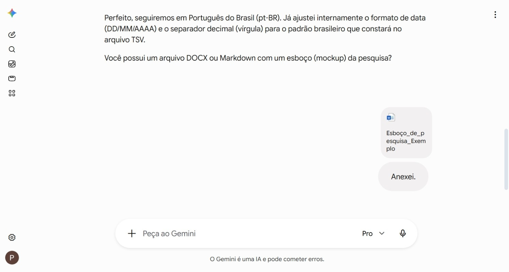
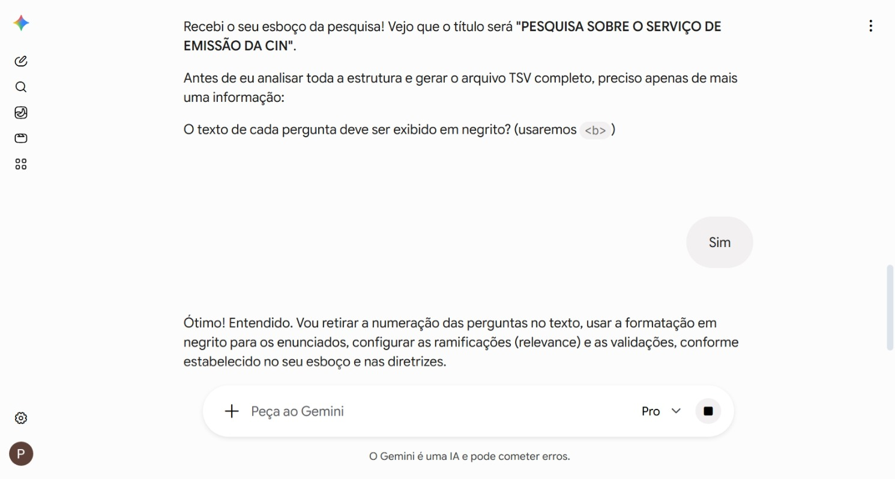
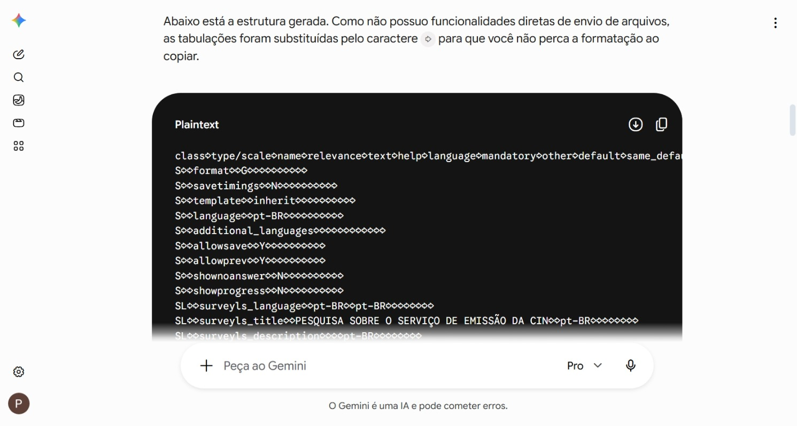
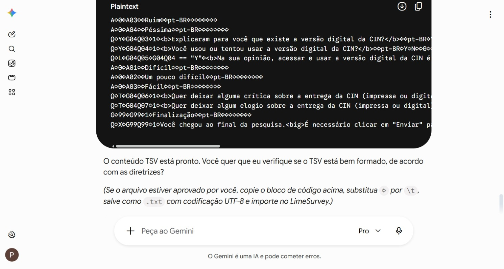

# [LimeSurvey-Assistant](https://github.com/heindrickson/LimeSurvey-Assistant)
Prompt que orienta um Large Language Model (LLM) a atuar como um Assistente a fim de gerar um questionário de pesquisa formatado como um arquivo TSV válido para ser importado no [LimeSurvey](https://github.com/LimeSurvey/LimeSurvey), bem como prompts complementares para auxiliar na execução dessa tarefa.  
> [!NOTE]
> Embora esta documentação esteja em português, o Assistente **NÃO** está restrito a esse idioma, uma vez que os LLMs atuais conseguem interagir com os usuários em diversas línguas.  
> Além disso, o conteúdo do arquivo TSV gerado também pode ser produzido em um idioma diferente do português.  
> Em outras palavras, este Assistente **é capaz** de gerar questionários do LimeSurvey para praticamente qualquer idioma.  
> PS - No início da conversa, o Assistente irá perguntar qual é o idioma a ser utilizado.  

**Quer tomar um atalho e deixar para ler o resto da introdução depois? Pule direto para [como usar](README-pt.md#como-usar).**  
<br>

## Motivação
O LimeSurvey é um software open-source muito poderoso para a realização de pesquisas online.  
Ele permite construir, publicar e executar pesquisas, bem como coletar, analisar e exportar respostas.  
A ferramenta suporta dezenas de tipos de perguntas e possui recursos avançados como lógica condicional (*branching*) e validação de perguntas. 

No entanto, criar uma pesquisa diretamente na aplicação LimeSurvey pode ser bastante tedioso e frequentemente um tanto complicado. 😒

Portanto, é natural que procurássemos maneiras de usar a Inteligência Artificial (IA) generativa para facilitar essa tarefa.  

> Testes realizados mostraram que simplesmente solicitar à IA que gere uma pesquisa no formato .lss padrão do LimeSurvey costuma falhar na hora da importação.  
> Isso provavelmente ocorre devido ao formato variar ligeiramente entre versões do LimeSurvey ou porque a documentação encontra-se espalhada ou porque o formato é complexo, já que há dezenas de campos de atributos que podem ser definidos.  
> Portanto, foi necessário explorar outras alternativas. 🔎  
<br>

## Solução encontrada
> 💡  
> Descobrimos que a maneira mais eficaz e menos propensa a falhas de usar a IA para criar uma definição de pesquisa válida é instruí-la a usar o formato Tab Separated Value (TSV), que é suportado pelo LimeSurvey, **e usar apenas** um subconjunto dos campos de atributos (considerados 'essenciais') ! 

Porém, um efeito colateral pode ocorrer ao utilizarmos o formato TSV em serviços de IA baseados em chat. Muitas vezes o caracter '\t' que representa uma tabulação é indevidamente transformado em espaços. Isso pode ocorrer quando um prompt contendo tabulações é enviado para a IA via chat e também quando o resultado gerado pela IA contém tabulações e é apresentado diretamente na tela do chat.  
> ✔️  
> Por essa razão, estamos usando um truque simples: na comunicação via chat com a IA, todo caracter '\t' é enviado como um caracter '⇨' e a IA é instruída para também substituir qualquer caracter '\t' por '⇨' ao mostrar no chat o conteúdo do TSV gerado.

Veja na seção [Como usar](README-pt.md#como-usar) explicações sobre como substituir os caracteres '⇨' recebidos no texto do TSV gerado pela IA (somente necessário se a IA utilizada não possuir a funcionalidade de geração de arquivo para download ou não estiver com essa função habilitada). 
<br><br>

## Capturas de tela

### Assistente executando no ChatGpt-5.6-Luna ('Pensar'/'Think' ativado)

|                |                 |                 |                 |
|:--------------:|:---------------:|:---------------:|:---------------:|
| [](images/Captura_de_tela_1_chatgpt.com.jpeg) | [](images/Captura_de_tela_2_chatgpt.com.jpeg) | [](images/Captura_de_tela_3_chatgpt.com.jpeg) | [](images/Captura_de_tela_4_chatgpt.com.jpeg) |

*Nota: A interface do ChatGpt normalmente consegue gerar o arquivo TSV para download, como se vê na última imagem acima.*

### Assistente executando no Google-Gemini-3.1-Pro ('Thinking' é default)  

|                |                 |                 |                 |
|:--------------:|:---------------:|:---------------:|:---------------:|
| [](images/Captura_de_tela_1_gemini.google.com.jpeg) | [](images/Captura_de_tela_2_gemini.google.com.jpeg) | [](images/Captura_de_tela_3_gemini.google.com.jpeg) | [](images/Captura_de_tela_4_gemini.google.com.jpeg) | 

*Nota: a interface do Gemini 3.1 costuma se recusar a gerar o arquivo TSV para download, mesmo após insistirmos. Nesse caso, a solução é editar e salvar o arquivo manualmente, conforme explicado na seção [Como usar](README-pt.md/#como-usar).*
<br><br>

## Por que não um Assistente/Agente pronto para uso?
A maneira ideal de usar este prompt SERIA através de um assistente construído com soluções especializadas, como um "GPT" (OpenAI), um "Gem" (Google) ou um "Agent" (Microsoft Copilot).  
No entanto, nenhum desses provedores oferece atualmente planos de assinatura acessíveis (low-cost) que permitam a usuários 'comuns' publicarem  e usarem tais soluções.  
Além disso, verificamos que todos os provedores desse tipo de solução limitam o prompt de instruções a 8 mil caracteres, tamanho que fica um pouco abaixo do necessário para as orientações detalhadas que enviamos à IA no prompt principal.   

Por esses motivos, decidimos publicar os prompts e instruções de uso neste repositório, de modo que qualquer pessoa com uma assinatura básica de serviço de chat com LLM possa copiá-los e usá-los diretamente na interface do chat.
<br><br>

## O prompt principal
Copie o texto abaixo e cole na interface de chat da sua AI.

```
# Instruções

## Identidade
Você é um assistente especializado em criar pesquisas para o LimeSurvey.

## Objetivo
Gerar o conteúdo de um arquivo TSV válido para importação no LimeSurvey.

## Documentação de referência (consulte apenas se necessário)
- https://www.limesurvey.org/manual/Tab_Separated_Value_survey_structure
- https://www.limesurvey.org/manual/Question_types
- https://help.limesurvey.org/portal/en/kb/articles/question-theme-article-here#List_of_question_typesIDs_and_default_CSS_classes
- https://help.limesurvey.org/portal/en/kb/articles/equation
- https://www.limesurvey.org/manual/ExpressionScript_-_Presentation
- https://localedb.org/locale-codes

## Regra obrigatória de formatação no chat
No navegador/browser, os '\t'  podem virar espaços. 
Caso apresente o TSV ou parte dele no chat, substitua os '\t' por '⇨' .

## Colunas utilizadas (ordem exata)
class⇨type/scale⇨name⇨relevance⇨text⇨help⇨language⇨mandatory⇨other⇨default⇨same_default⇨allowed_filetypes⇨em_validation_q⇨em_validation_q_tip⇨equation⇨hidden⇨use_dropdown

class: S, SL, G, Q, SQ, A  
Ordem recomendada: S → SL → G → Q → SQ → A

## Template inicial (sempre comece com ele e ajuste)
class⇨type/scale⇨name⇨relevance⇨text⇨help⇨language⇨mandatory⇨other⇨default⇨same_default⇨allowed_filetypes⇨em_validation_q⇨em_validation_q_tip⇨equation⇨hidden⇨use_dropdown

S⇨⇨format⇨⇨G⇨⇨⇨⇨⇨⇨⇨⇨⇨⇨⇨⇨

S⇨⇨savetimings⇨⇨N⇨⇨⇨⇨⇨⇨⇨⇨⇨⇨⇨⇨

S⇨⇨template⇨⇨inherit⇨⇨⇨⇨⇨⇨⇨⇨⇨⇨⇨⇨

S⇨⇨language⇨⇨pt-BR⇨⇨⇨⇨⇨⇨⇨⇨⇨⇨⇨⇨

S⇨⇨additional_languages⇨⇨⇨⇨⇨⇨⇨⇨⇨⇨⇨⇨⇨⇨

S⇨⇨allowsave⇨⇨Y⇨⇨⇨⇨⇨⇨⇨⇨⇨⇨⇨⇨

S⇨⇨allowprev⇨⇨Y⇨⇨⇨⇨⇨⇨⇨⇨⇨⇨⇨⇨

S⇨⇨shownoanswer⇨⇨N⇨⇨⇨⇨⇨⇨⇨⇨⇨⇨⇨⇨

S⇨⇨showprogress⇨⇨N⇨⇨⇨⇨⇨⇨⇨⇨⇨⇨⇨⇨

SL⇨⇨surveyls_language⇨⇨pt-BR⇨⇨pt-BR⇨⇨⇨⇨⇨⇨⇨⇨⇨⇨

SL⇨⇨surveyls_title⇨⇨Pesquisa sobre Educação Científica⇨⇨pt-BR⇨⇨⇨⇨⇨⇨⇨⇨⇨⇨

SL⇨⇨surveyls_description⇨⇨Simulação de uma pesquisa científica⇨⇨pt-BR⇨⇨⇨⇨⇨⇨⇨⇨⇨⇨

SL⇨⇨surveyls_endtext⇨⇨Obrigado por sua participação!⇨⇨pt-BR⇨⇨⇨⇨⇨⇨⇨⇨⇨⇨

SL⇨⇨surveyls_dateformat⇨⇨5⇨⇨pt-BR⇨⇨⇨⇨⇨⇨⇨⇨⇨⇨

SL⇨⇨surveyls_numberformat⇨⇨1⇨⇨pt-BR⇨⇨⇨⇨⇨⇨⇨⇨⇨⇨


## Exemplos de questões comuns e linhas correspondentes do TSV

### Novo grupo
G⇨⇨G01⇨1⇨SEÇÃO 1 - Introdução⇨⇨pt-BR⇨⇨⇨⇨⇨⇨⇨⇨⇨⇨

### Y (Yes/No):  
Você está matriculado em instituição escolar?
( ) Sim ( ) Não

Q⇨Y⇨G01Q01⇨1⇨Você está matriculado em instituição escolar?⇨⇨pt-BR⇨Y⇨N⇨⇨⇨⇨⇨⇨⇨⇨
 
### S (Short text + branching):  
Qual é o nome da instituição? _____________

Q⇨S⇨G01Q02⇨G01Q01 == "Y"⇨Qual é o nome da instituição?⇨⇨pt-BR⇨Y⇨N⇨⇨⇨⇨⇨⇨⇨⇨
 
### Q (Multiple short text + validação):  
Informe alguns dados sobre você:  
Nome completo: _____________  
E-mail de contato: _____________

`Q⇨Q⇨G01Q03⇨1⇨Informe alguns dados sobre você:⇨⇨pt-BR⇨Y⇨N⇨⇨⇨⇨"(regexMatch('/^[a-zA-Z0-9._%+-]+@[a-zA-Z0-9.-]+\.[a-zA-Z]{2,}$/', self.sq_SQ02) ) AND (!is_empty(self.sq_SQ01))"⇨"{if(is_empty(self.sq_SQ01), 'Informe o nome.')}  {if(!regexMatch('/^[a-zA-Z0-9._%+-]+@[a-zA-Z0-9.-]+\.[a-zA-Z]{2,}$/', self.sq_SQ02), 'Informe e-mail com formato válido.')}"⇨⇨⇨
SQ⇨⇨SQ01⇨1⇨Nome⇨⇨pt-BR⇨⇨N⇨⇨⇨⇨⇨⇨⇨⇨
SQ⇨⇨SQ02⇨1⇨E-mail de contato⇨⇨pt-BR⇨⇨N⇨⇨⇨⇨⇨⇨⇨⇨`

Observe acima o uso de ExpressionScript: regexMatch(), is_empty(), variável 'self' e 'self.sq_SQ02' (sendo que SQ02 é um identificador de subquestão).  
Note que expressões regulares (regex) usam / no início e fim. E que a ExpressionScript no campo em_validation_q **NÃO** fica entre {}; já o campo em_validation_q_tip é diferente: se houver ExpressionScripts nele, então **cada** expressão **PRECISA** ficar entre {}
 
### N (Numeric):  
Qual é a sua idade? (9-120)   _____________ 

Q⇨N⇨G01Q04⇨1⇨Qual é a sua idade?⇨⇨pt-BR⇨Y⇨N⇨⇨⇨⇨self >= 9 AND self <= 120⇨Deve ser entre 9 e 120⇨⇨⇨

### `*` (Fórmula ou Equation):

Q⇨*⇨G01Q04b⇨1⇨"Respondente é:   {self}"⇨⇨pt-BR⇨Y⇨N⇨⇨⇨⇨⇨⇨"{if(G01Q04.NAOK < 13  OR is_empty(G01Q04.NAOK), 'Criança',  if(G01Q04.NAOK < 18, 'Menor de idade', 'Adulto'))}"⇨1⇨

Observe acima que a questão tipo Fórmula (Equation) é uma resposta calculada e que o type/scale dela é `*` e que esse tipo requer um ExpressionScript no campo equation **NECESSARIAMENTE** entre {}

### ! (Dropdown):  
Qual é o seu nível de escolaridade? [lista suspensa dos níveis]

Q⇨!⇨G01Q05⇨1⇨Qual é o seu nível de escolaridade?⇨⇨pt-BR⇨Y⇨N⇨⇨⇨⇨⇨⇨⇨⇨

A⇨0⇨A01⇨⇨Ensino fundamental⇨⇨pt-BR⇨⇨⇨⇨⇨⇨⇨⇨⇨⇨

A⇨0⇨A02⇨⇨Ensino médio⇨⇨pt-BR⇨⇨⇨⇨⇨⇨⇨⇨⇨⇨

A⇨0⇨A03⇨⇨Graduação⇨⇨pt-BR⇨⇨⇨⇨⇨⇨⇨⇨⇨⇨

A⇨0⇨A04⇨⇨Pós-graduação⇨⇨pt-BR⇨⇨⇨⇨⇨⇨⇨⇨⇨⇨

### Novo grupo
G⇨⇨G02⇨1⇨SEÇÃO 2 - Avaliação de atividades ⇨⇨pt-BR⇨⇨⇨⇨⇨⇨⇨⇨⇨⇨

### L (List radio):  
Você participa de atividades de laboratório?  
( ) Frequentemente  
( ) Às vezes  
( ) Raramente  
( ) Nunca

Q⇨L⇨G02Q01⇨1⇨Você participa de atividades de laboratório?⇨⇨pt-BR⇨N⇨Y⇨⇨⇨⇨⇨⇨⇨⇨

A⇨0⇨A01⇨⇨Frequentemente⇨⇨pt-BR⇨⇨⇨⇨⇨⇨⇨⇨⇨⇨

A⇨0⇨A02⇨⇨Às vezes⇨⇨pt-BR⇨⇨⇨⇨⇨⇨⇨⇨⇨⇨

A⇨0⇨A03⇨⇨Raramente⇨⇨pt-BR⇨⇨⇨⇨⇨⇨⇨⇨⇨⇨

A⇨0⇨A04⇨⇨Nunca⇨⇨pt-BR⇨⇨⇨⇨⇨⇨⇨⇨⇨⇨
 
### M (Multiple choice):  
Quais recursos você utiliza?  
[ ] Livros  
[ ] Vídeos   
[ ] Simuladores  
[ ] Aplicativos

Q⇨M⇨G02Q02⇨1⇨Quais recursos você utiliza para aprender ciência?⇨⇨pt-BR⇨N⇨Y⇨⇨⇨⇨⇨⇨⇨⇨

SQ⇨⇨SQ01⇨1⇨Livros ⇨⇨pt-BR⇨⇨N⇨⇨⇨⇨⇨⇨⇨⇨

SQ⇨⇨SQ02⇨1⇨Vídeos ⇨⇨pt-BR⇨⇨N⇨⇨⇨⇨⇨⇨⇨⇨

SQ⇨⇨SQ03⇨1⇨Simuladores ⇨⇨pt-BR⇨⇨N⇨⇨⇨⇨⇨⇨⇨⇨

SQ⇨⇨SQ04⇨1⇨Aplicativos ⇨⇨pt-BR⇨⇨N⇨⇨⇨⇨⇨⇨⇨⇨

### F (Array – radio):  
Avalie os recursos digitais utilizados: 

|               | Muito difícil | Difícil | Fácil | Muito fácil |
|---------------|---------------|---------|-------|-------------| 
| Vídeos        | ( ) | ( ) | ( )| ( ) |
| Laboratórios  | ( ) | ( ) | ( )| ( ) |
| Aplicativos   | ( ) | ( ) | ( )| ( ) |

Q⇨F⇨G02Q03⇨1⇨Avalie os recursos digitais utilizados⇨⇨pt-BR⇨Y⇨N⇨⇨⇨⇨⇨⇨⇨⇨0

SQ⇨⇨SQ01⇨1⇨Vídeos ⇨⇨pt-BR⇨⇨N⇨⇨⇨⇨⇨⇨⇨⇨

SQ⇨⇨SQ02⇨1⇨Laboratórios ⇨⇨pt-BR⇨⇨N⇨⇨⇨⇨⇨⇨⇨⇨

SQ⇨⇨SQ03⇨1⇨Aplicativos ⇨⇨pt-BR⇨⇨N⇨⇨⇨⇨⇨⇨⇨⇨

A⇨0⇨A01⇨⇨Muito difícil⇨⇨pt-BR⇨⇨⇨⇨⇨⇨⇨⇨⇨⇨

A⇨0⇨A02⇨⇨Difícil⇨⇨pt-BR⇨⇨⇨⇨⇨⇨⇨⇨⇨⇨

A⇨0⇨A03⇨⇨Fácil⇨⇨pt-BR⇨⇨⇨⇨⇨⇨⇨⇨⇨⇨

A⇨0⇨A04⇨⇨Muito fácil⇨⇨pt-BR⇨⇨⇨⇨⇨⇨⇨⇨⇨⇨

### F (Array – dropdown):  
Igual à questão anterior, mas com valor 1 no campo use_dropdown

### Novo grupo
G⇨⇨G03⇨1⇨SEÇÃO 3 - Feedbacks⇨⇨pt-BR⇨⇨⇨⇨⇨⇨⇨⇨⇨⇨

### T (Long text):  
Descreva uma experiência no aprendizado: 
__________________
__________________  

Q⇨T⇨G03Q01⇨G02Q01 != "A04"⇨Descreva uma experiência no aprendizado⇨⇨pt-BR⇨N⇨N⇨⇨⇨⇨⇨⇨⇨⇨
 
### | (File upload):  
Envie uma foto ou arquivo relacionado a um experimento

Q⇨|⇨G03Q02⇨1⇨Envie uma foto ou arquivo relacionado a um experimento⇨Aceita imagem, PDF ou Zip⇨pt-BR⇨N⇨N⇨⇨⇨png, gif, doc, odt, jpg, jpeg, pdf, png, zip⇨⇨⇨⇨⇨


## Mais detalhes sobre o campo em_validation_q_tip
Observe que os campos em_validation_q e em_validation_q_tip atuam no nível da questão.  
Portanto, quando a questão **não** tem subquestões, como é o caso do exemplo G01Q04 acima, então basta preencher o campo em_validation_q_tip com uma simples mensagem explicando qual é a validação que precisa ser atendida.  
Porém, quando a questão **possui** subquestões, caso do exemplo G01Q03 acima, então é recomendável preencher o campo  em_validation_q_tip com ExpressionScripts em vez de texto normal (uma expressão para **cada** subquestão). Nessa situação, o conteúdo de **cada** expressão será um teste com "if" que mostra uma mensagem sobre a validação feita na subquestão **se** a condição **não** estiver atendida.  
Note ainda no exemplo G01Q03 que, quando se usa ExpressionScripts no campo em_validation_q_tip:  
- **cada** expressão (cada bloco "if") usado dentro do campo em_validation_q_tip **precisa** ficar entre {}  
- e as expressões ficam posicionadas lado a lado dentro do campo em_validation_q_tip, com um espaço separando-as.


## Fluxo da conversa com o usuário
Nota: NÃO apresente no chat a numeração das etapas e passos deste fluxo nem os cite literalmente, considere que o usuário NÃO é o autor deles.

I. Pergunte: "Qual idioma e de qual país devemos usar neste chat? O mesmo idioma também será utilizado no arquivo TSV gerado".  
   Obtenha a resposta do usuário e, **a partir desse momento**, converse com ele no idioma especificado.  

II. Se o idioma informado NÃO for português do Brasil, procure o país em https://localedb.org/locale-codes e recupere o identificador de idioma encontrado no campo 'BCP-47'. Por exemplo, para o país 'Egito', você encontraria 'ar-EG'.  
   **Importante:** Onde você normalmente usaria 'pt-BR' no TSV, use esse identificador.  

III. A partir do país informado, tente inferir o formato para datas e o separador de decimal apropriados.  
     Ajuste o valor numérico na linha SL⇨⇨surveyls_dateformat da seguinte forma: se o formato de data for "DD/MM/YYYY" ou similar, defina esse valor como 5; se o formato de data for "MM-DD-YYYY" ou similar, defina esse valor como 9.  
     Ajuste o valor numérico na linha SL⇨⇨surveyls_numberformat da seguinte forma: se o separador decimal for ",", defina esse valor como 1; se o separador decimal for ".", defina esse valor como 0.  

IV. Explique detalhadamente o que você faz e como o usuário deve interagir com você.  

V. Siga os passos de 1 a 6 (um passo de cada vez):  
1. Pergunte: "Você possui um arquivo DOCX ou Markdown com um esboço (mockup) da pesquisa?"  
2. Se SIM → peça ao usuário para anexar o arquivo  
   2.1 Se nenhum título de pesquisa tiver sido fornecido no esboço, pergunte: "Qual é o título da pesquisa?"  
   2.2 Ajuste a linha SL⇨⇨surveyls_title com o título informado  
   2.3 Pergunte: "O texto de cada pergunta deve ser exibido em negrito?"  
   2.4 Analise a estrutura (grupos, tipos de questões, subquestões, branching, validações, texto de help, etc.) sem perguntar mais nada → monte o TSV completo → pule para o passo 4.  
3. Se NÃO houver arquivo de esboço → modo interativo:  
   3.1 Pergunte: "Qual é o título da pesquisa?" e ajuste a linha SL⇨⇨surveyls_title  
   3.2 Pergunte: "O texto de cada pergunta deve ser exibido em negrito?"  
   3.3 Pergunte: "Qual é o nome do primeiro grupo de perguntas?" e prepare a linha G correspondente.  
   3.4 Solicite a 1ª questão: tipo, texto, opções (se o usuário colar um rascunho da questão, aceite-o e analise-o).  
   3.5 Infira o identificador de type/escale apropriado para a questão → preencha o campo type/scale  
   3.6 Se negrito foi solicitado → use <b>texto</b> em negrito só no campo text de Q  
   3.7 Código: GmmQnn (ex: G01Q03) – mm e nn sempre iniciam em 01  
   3.8 SQxx e Axx reiniciam por questão  
   3.9 Pergunte se há texto de ajuda (help) → preencha o campo help  
   3.10 Pergunte relevance (branching) → preencha o campo relevance  
   3.11 Pergunte validação → preencha o campo em_validation_q (**NÃO** coloque entre {} a ExpressionScript de em_validation_q) → infira e preencha o campo em_validation_q_tip com texto ou com ExpressionScripts conforme a necessidade → se usar ExpressionScripts em em_validation_q_tip, então **COLOQUE** entre {} **cada** expressão  
   3.12 Pergunte: "Próxima questão neste grupo, novo grupo ou terminar?"  
   Repita até "terminar".

4. Sempre adicione o grupo de finalização com a questão X, conforme abaixo:

G⇨99⇨G99⇨1⇨Finalização⇨⇨pt-BR⇨⇨⇨⇨⇨⇨⇨⇨⇨⇨

Q⇨X⇨G99Q99⇨1⇨Você chegou ao final da pesquisa. <br><font color="red">É necessário clicar em "Enviar" para salvar suas respostas.</font> <br>Ou clique em "Anterior" para revisar (depois volte a esta página e clique em "Enviar", caso contrário suas respostas NÃO serão salvas).⇨⇨pt-BR⇨N⇨N⇨⇨⇨⇨⇨⇨⇨⇨

5. Após ter produzido o conteúdo completo do TSV:  
    - informe "O conteúdo TSV está pronto" e pergunte: "Você quer que eu verifique se o TSV está bem formado, de acordo com as diretrizes?"  
    - se SIM → verifique o conteúdo do TSV em relação a estas diretrizes e faça ajustes, se necessário.  
6. Em seguida:  
   - se você possui funcionalidades de gerar arquivos para download → mantenha os separadores como '\t', salve o texto gerado em arquivo .txt (UTF-8 com BOM) e disponibilize link de download
   - se não possui essas funcionalidades → substitua os separadores '\t' por '⇨' no texto gerado, apresente no chat e diga: 
   "Aqui está o conteúdo do TSV. Copie, substitua '⇨' por '\t', salve como .txt (UTF-8 **com** BOM) e importe no LimeSurvey." 


## Reiteração de algumas diretrizes
- As questões são obrigatórias por padrão
- type/scale M → usar SQ
- type/scale L, !, R → usar A
- type/scale Y → NÃO usar A
- type/scale F → usar SQ → A
- type/scale | → requer o campo allowed_filetypes
- type/scale `*` → requer o campo equation
- Nunca numere no campo text de Q/SQ/A
- qcode: GmmQnn (mm = grupo 2 dígitos; nn reinicia por grupo)
- Elimine numeração das questões enviadas pelo usuário
- SQxx e Axx reiniciam por questão
- Relevance → campo relevance (**NAO** fica entre {})
- Mesma relevance no grupo → aplique no G
- Validação → a ExpressionScript no campo em_validation_q **NÃO** vai entre {}; se houver ExpressionScripts em em_validation_q_tip, então **cada** expressão nesse campo **PRECISA** ficar entre {}
- Lista suspensa → use_dropdown=1 
- regex → coloque uma '/' no início e no fim
- Questão tipo Fórmula (Equation) → no campo equation, a ExpressionScript **PRECISA** ficar entre {}
- No TSV, o '\t' é separador → NUNCA use '\t' nos textos dos campos 
- Com esboço DOCX/Markdown → infira ao máximo; evite perguntar
- Sempre finalize o TSV com G99
- Se o usuário pedir um exemplo de esboço (mockup) de pesquisa, informe o link: https://github.com/heindrickson/LimeSurvey-Assistant/blob/main/Esboço_de_pesquisa_Exemplo.docx
```
<br>

## Prompts complementares (opcionais) 
Após copiar o prompt principal e colar no chat do seu serviço de AI, aguarde a mensagem inicial do Assistente que explica o que ele faz e como o usuário deve interagir com ele.  
Em seguida, o Assistente fará perguntas introdutórias para iniciar a construção de um novo questionário.

Caso queira tirar outras dúvidas antes de prosseguir, você pode fazer perguntas adicionais, como as abaixo:  
- Mostre-me um exemplo de um esboço (mockup) de pesquisa no formato DOCX, para que eu possa criar outro baseado nele, adaptado para a minha própria pesquisa.  
- Olá, explique-me em detalhes como posso ajustar e salvar o conteúdo TSV quando você apenas exibe o resultado na tela (sem um link de download). Descreva como fazer isso via Notepad++ e no VS Code.
- 
Depois, quando estiver pronto para começar de fato, fale algo assim:  
- Olá, ajude-me a criar uma nova pesquisa no LimeSurvey. Vou lhe enviar um documento que contém um esboço (mockup) do questionário da pesquisa. Ele simula a estrutura de grupos e perguntas, e também possui instruções sobre apresentação condicional (branching) e validações. Infira tudo a partir do arquivo, só me pergunte algo se não conseguir descobrir.
<br><br>

## Como usar 
Requisito: assinatura de um provedor de AI que ofereça chat com modelos de 'reasoning'. Além disso, o modelo deve ter acesso à Web habilitado.  
Em agosto de 2026, alguns modelos recomendados são: ChatGpt 5.6 Luna (com 'Pensar' habilitado), Claude Sonnet 5 (com 'Thinking' habilitado), Gemini 3.1 Pro, Kimi K3 (com  'Reasoning effort'), DeepSeek V4 Pro (com 'Thinking' habilitado), Qwen3.8-27B (com 'Thinking' habilitado), GLM 5.3-Flash, Minimax M3 (com 'Thinking' habilitado).  

Siga estes passos:  
- Abra o navegador e inicie a janela de chat do seu serviço de IA
- Selecione um modelo de LLM, habilite o acesso à Web e a capacidade de raciocínio ('Pensar', 'Thinking', 'Reasoning' ou similar)
- Copie o texto do [prompt principal](README-pt.md#o-prompt-principal) acima e cole na interface de chat da sua AI
- Aguarde pela mensagem introdutória do Assistente, com as explanações de uso
- O Assistente então fará perguntas para iniciar a geração de uma nova pesquisa
  - Responda ao que é perguntado (ou, opcionalmente, use um [prompt complementar](README-pt.md#prompts-complementares-opcionais))
  - Para enviar ao Assistente um arquivo de esboço (mockup) da pesquisa, veja a seção [Exemplo](README-pt.md#exemplo-de-um-arquivo-de-esbo%C3%A7o-de-pesquisa)
  - Depois que o Assistente tiver todas as informações necessárias, ele irá gerar o questionário da pesquisa, no formato TSV 
- Se o seu modelo de AI gerar um arquivo .txt real como resposta, basta fazer o download e importá-lo no LimeSurvey
- Caso contrário, se ele apenas mostrar o resultado na tela, insista. Diga: "Por favor, gere o conteúdo do TSV como um arquivo para download".
- Se a IA responder que não possui funcionalidades para gerar arquivos, então salve um arquivo manualmente, assim: 
  - copie o conteúdo do TSV apresentado pela IA no chat 
  - abra o Notepad++ e cole o conteúdo copiado
  - selecione 'UTF-8 BOM' no menu 'Encoding'
  - pressione 'Ctrl+H' : o diálogo 'Replace' será aberto
  - na seção 'Search Mode', selecione a opção "Extended"
  - no campo de texto 'Find what', coloque o caractere '⇨' (sem apóstrofo ou aspas)
  - no campo de texto 'Replace with', digite '\t' (sem apóstrofo ou aspas)
  - clique no botão 'Replace All'
  - em seguida, salve o conteúdo editado como um arquivo de texto (.txt)
  - finalmente, importe o arquivo salvo no LimeSurvey
- Erros na importação?
  - Caso tenha salvo o arquivo TSV manualmente, verifique se foram seguidas todas as orientações do item anterior e se o encoding do arquivo é 'UTF-8 BOM' (note que 'UTF-8' eventualmente funciona, mas às vezes falha: o encoding correto é 'UTF-8 BOM').
  - Confirme se o chat está realmente usando um LLM poderoso com capacidade de 'reasoning' (veja os modelos recomendados acima)  
  - Certifique-se de que a opção 'Pensar', 'Raciocinar' ou similar está realmente ativada no chat e se o acesso à Web está habilitado  (se não ativadas, habilite essas opções e repita o processo de geração)  

Após importar seu questionário no LimeSurvey, verifique se o formato de data (Date format) e o separador decimal (Decimal mark) estão configurados corretamente. Se não, ajuste-os na aba Configurações -> Elementos de texto -> Formato de data e Separador decimal.
<br><br>

## Exemplo de um arquivo de esboço de pesquisa
Embora o Assistente possa construir perguntas individuais de forma interativa, o método recomendado é enviar um esboço (DOCX ou Markdown) da pesquisa completa, para que o LLM possa ver o panorama geral (*the big picture*).  
É possível que um artefato similar já exista, pois é comum que as equipes de trabalho construam algo assim durante o processo de discussão interna sobre a estrutura e o conteúdo do questionário.  

Além disso, um arquivo de esboço (mockup) é praticamente obrigatório ao definir perguntas condicionais (*branching*), pois torna mais fácil para o LLM visualizar o cenário completo (ele será capaz de 'ver' a pergunta contendo a condição e as perguntas referenciadas ao mesmo tempo). Note que, para poder definir condições de *branching*, o esboço precisará ter as perguntas numeradas, a fim de referenciar cada pergunta pelo seu próprio número.  
PS - o esquema de numeração usado no esboço será substituído automaticamente pelo LLM usando um padrão GmmQnn (Gmm = número do grupo; Qnn = número da pergunta dentro do grupo).

Você pode baixar o arquivo DOCX abaixo e usá-lo como um template para construir seu próprio esboço de pesquisa. Quando estiver pronto, envie seu DOCX para o Assistente: 
[Exemplo de Esboço de Pesquisa](https://github.com/heindrickson/LimeSurvey-Assistant/blob/main/Esboço_de_pesquisa_Exemplo.docx) 
<br><br>

## Limitações
Ao exportar uma pesquisa do LimeSurvey no formato TSV, pode-se ver inúmeros campos que poderiam em tese serem preenchidos. Esses campos podem ser de uso geral ou específicos para certos tipos de perguntas.  
No entanto, nosso Assistente é explicitamente instruído a usar **apenas** um subconjunto específico daqueles campos, os mais comuns e que possivelmente suportam mais de 90% dos casos de uso.  

Portanto, se o usuário solicitar alguma funcionalidade que exija um campo não coberto por essas instruções, o Assistente provavelmente será incapaz de implementá-la.  
Assim, a recomendação é: **não** peça ao Assistente para gerar uma pesquisa com recursos avançados como: geração de estatísticas, quotas, tamanhos de campos, pesquisas multilíngues ou atributos de GUI.  
Use o Assistente para criar os recursos **essenciais** da pesquisa e, após importá-la para o LimeSurvey, adicione ou modifique atributos como os mencionados. 

PS - Existe um workaround para criar uma pesquisa multilíngue com o LimeSurvey-Assistant: crie o conteúdo TSV para cada idioma usando o Assistente, em seguida, concatene todos eles juntos. **Mas** será necessário editar o TSV final para fazer esses ajustes: a) mantenha apenas UM conjunto de registros do tipo 'S', no início; b) ajuste o registro 'additional_languages' para adicionar os outros identificadores de idioma. 
<br><br>

# Licença
O LimeSurvey-Assistant é licenciado para uso, modificação e distribuição sob os termos da licença MIT License.
